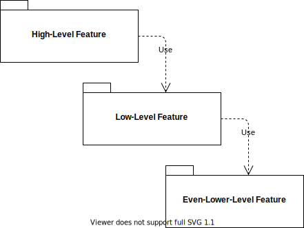
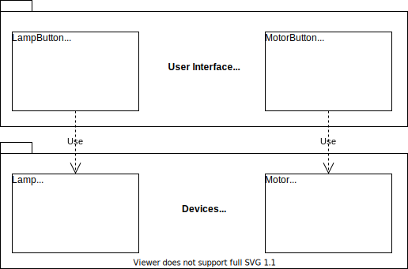
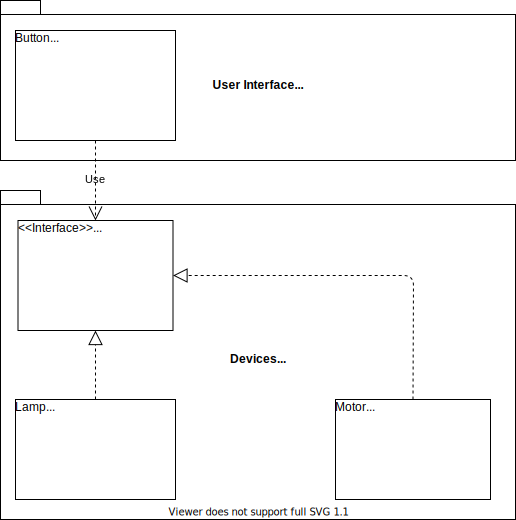
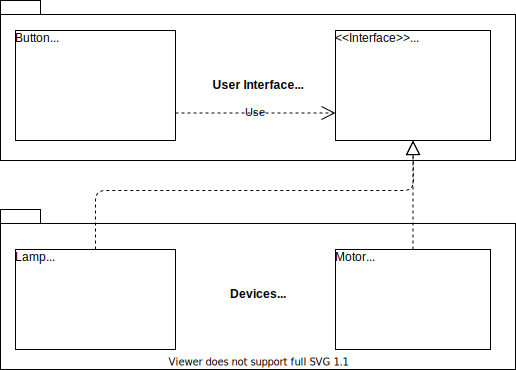

# SOLID
## Dependency Inversion Principle (DIP)

---

<style scoped>
li { 
  margin: 0px;
}
</style>

### Dependency Inversion Principle


> **_"(a.) High-level modules shoud not depend on low-level modules. Both should depend on abstractions.
(b.) Abstractions should not depend on details. Details should depend on abstractions."_** [Robert C. Martin]

##### Why?
* Increase of Maintainability
* Increase of Reusability
* Decrease of Rigidity

---

### Procedural Program Design



---

### Procedural Program Design


#### Program Design follows Call-Hierarchy:

  * High-level features depend on low-level features

  * Low-level features depend on even-lower-level features
  
  * ...

---

### Procedural Program Design


#### Possible Risks:

1. Changes on lower-level features are propaged to higher-level features

E.g. Adding a parameter to a lower-level method requires higher-level features to provide a suitable argument.

Also, reuse of higher-level features is impossible, because of _hard_ dependencies.

---

### Example without Dependency Inversion



---

### Example without Dependency Inversion

#### Constraint A

> _"(a.) High-level modules shoud not depend on low-level modules. Both should depend on abstractions."_ [Robert C. Martin]

&#9746; **LampButton/MotorButton** (high-level) depends on **Lamp/Motor** (lovw-level). :-(
&#9746; No abstractions are present. :-(

#### Constraint B

> _"(b.) Abstractions should not depend on details. Details should depend on abstractions."_ [Robert C. Martin]

&#9746; No abstractions are present. :-(

---

### Example with _Naive_ Dependency Inversion



---

### Example with _Naive_ Dependency Inversion

#### Constraint A

> _"(a.) High-level modules shoud not depend on low-level modules. Both should depend on abstractions."_ [Robert C. Martin]

&#9746; **UI/Button** (high-level) depends on **Devices/IDevice** (lovw-level). :-(
&#9745; **UI/Button** and **Devices/Lamp/Motor** depend on **Devices/IDevice** (abstraction). :-)

#### Constraint B

> _"(b.) Abstractions should not depend on details. Details should depend on abstractions."_ [Robert C. Martin]

&#9746; **UI/Button** (abstraction) depends on **Devices/IDevice** (details). :-(
&#9746; **Devices** (details) does not depend on **UI** (abstraction). :-(

---

### Example with _Naive_ Dependency Inversion


#### Why is it _Naive_?

* **Package dependency is not inverted.**

Changes can still propagate from lower-level features to higher-level features.

The client of the interface does not "own" it. This still allows changes to originate in lower-level features when changes are triggred bottom-up, i.e. not triggred by usages.

---

### Example with Dependency Inversion



---

### Example with Dependency Inversion

#### Constraint A

> _"(a.) High-level modules shoud not depend on low-level modules. Both should depend on abstractions."_ [Robert C. Martin]

&#9745; **UI/Button** (high-level) does not depend **Devices/Lamp/Motor** (lovw-level). :-)
&#9745; **UI/Button** and **Devices/Lamp/Motor** depend on **UI/ISwitchable** (abstraction). :-)

#### Constraint B

> _"(b.) Abstractions should not depend on details. Details should depend on abstractions."_ [Robert C. Martin]

&#9745; **UI/Button** (abstraction) does not depend  on **Devices/Lamp/Motor** (details). :-)
&#9745; **Devices/Lamp/Motor** (details)  depends on **UI/ISwitchable** (abstraction). :-)

---

### Example with Dependency Inversion


#### Package Dependency is inverted!

Low-level devices must do some work in order to work with the high-level UI feature.

High-level features like Button can be reused.

---

### Where is the Inversion?

#### Without DIP: UI _using_ Devices

```c#
using Devices;

class LampButton
{
  private Lamp _lamp;
  public void Press() { _lamp.TurnOn(); }
}

class MotorButton : ISwitchable
{
  private Motor _motor;
  public void Press() { _motor.TurnOn(); }
}
```
```c#
class Lamp { ... }

class Motor { ... }
```

---

### Where is the Inversion?

#### With Naive DIP: UI still _using_ Devices

```c#
using Devices;

class Button 
{
  private IDevice _device;
  public void Press() { _device.TurnOn(); }
}
```
```c#
interface IDevice { ... }

class Lamp : IDevice { ... }

class Motor : IDevice { ... }
```

---
### Where is the Inversion?

#### With DIP: Devices _using_ UI

```c#
interface ISwitchable { ... }

class Button 
{
  private ISwitchable _switchable;
  public void Press() { _switchable.TurnOn(); }
}
```
```c#
using UI;

class Lamp : ISwitchable { ... }

class Motor : ISwitchable { ... }
```

---

# Dependency Inversion
## Don't call us, we'll call you!

---

### Why does nobody mention Dependency Injection?

Because it has **nothing** to do with Dependency _Inversion_!

* Dependency **Inversion**
is about module/package/class design

* Dependency **Injection**
is about instantiating classes

---

# Thanks!