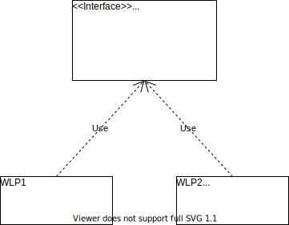
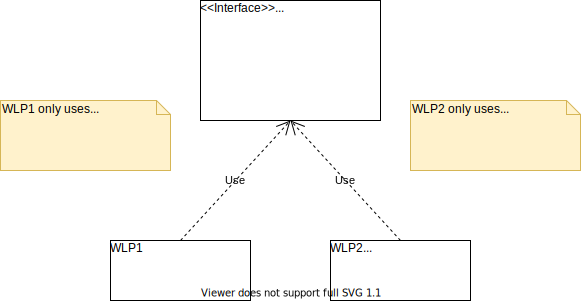
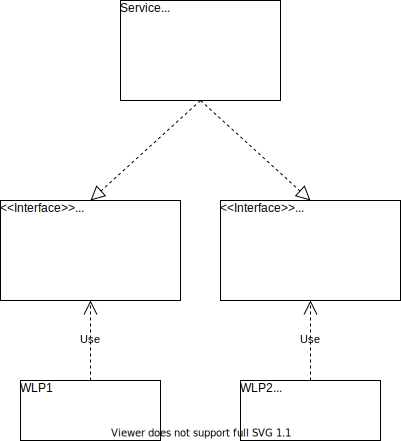

# SOLID
## Interface Segregation Principle (ISP)

---

### Interface Segregation Principle

> **_"Clients should not be forced to depend upon interfaces that they do not use."_** [Robert C. Martin]

##### Why?
* Increase of Maintainability
* Decrease of Rgidity

---

### Example: "Loose White-Labeling"

#### Scenario:

1. A service is provided as separate assembly

2. The service is used by more than 1 WLP implementation

3. One WLP requests an individual change

4. All other WLPs are forced to adapt

WLP = White-Label Partner

---

### Example: "Loose White-Labeling"

#### Before:

---

### Example: "Loose White-Labeling"

#### After:

---

### Example: "Loose White-Labeling"

#### Possible Risks:

1. Exposure of information to other WLP implementations

2. Unnecessary re-deployment for all WLP implementations

3. Breaking behavior for other WLP implementations

WLP = White-Label Partner

---

### Example: "Loose White-Labeling"

#### Solution:

> **_"Clients should not be forced to depend upon interfaces that they do not use."_** [Robert C. Martin]

1. Introduce separate interfaces for each WLP

2. WLP implementations only use individual interfaces

3. Implement all interfaces on the used service

WLP = White-Label Partner

---

### Example: "Loose White-Labeling"

#### Solution:

---

# Thanks!