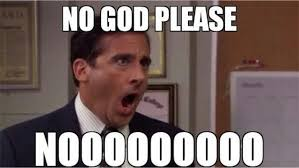
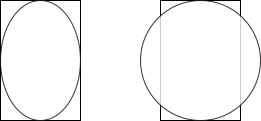

# SOLID
## Liskov Substitution Principle (LSP)

---

<style scoped>
li { 
  margin: 0px;
}
</style>

### Liskov Substitution Principle


> **_"Functions that use pointers or references to base classes must be able to use objects of derived classes without knowing it."_** [Robert C. Martin]

##### Why?
* Increase the overall **Robustness** of the application through increase of determinism in behavior

---

### Liskov Substitution Principle

> **_"If for each object $o_1$ of type $S$ ther is an object $o_2$ of type $T$ such that for all programs $P$ defined in terms of $T$, the bahavior of $p$ is unchanged when $o_1$ is substituted for $o_2$, then $S$ is a subtype of $T$."_** [Barbara Liskov]

Liskov, Barbara. _Data Abstraction and Hierarchy_. SIGPLAN Notices, 23,5 (May 1988)

> **_"Subtype Requirement: Let $\phi(x)$ be a property provable about objects $x$ of type $T$. Then $\phi(y)$ shoud be true for objects $y$ of type $S$ where $S$ is a subtype of $T$."_** [Barbara Liskov, Jeannette M. Wing]

Barbara Liskov, Jeannette M. Wing: _A Behavioral Notion of Subtyping_. ACM Trans. Program. Lang. Syst. 16(6): 1811-1841 (1994)


---

<style scoped>
h1 { 
  margin-top: 100px;
}
</style>

### LSP In A Nutshell

# Subtypes must preserve behavior of their supertypes.

---

<style scoped>
h1 { 
  margin-top: 0px;
  margin-bottom: 130px
}
</style>

### The Circle-Ellipse Problem

Also called _Square–Rectangle Problem_. See more on this topic on [Wikipedia](https://en.wikipedia.org/wiki/Circle–ellipse_problem).

Illustrates problems arising from use of _Subtype Polymorphism_ in object-oriented design.

A simple question:

# Circles are Ellipses, right?

FYI: _Subtype Polymorphism_ is the fancy name of Inheritence, a key technique for achieving Open/Closed systems, see _Open/Closed Principle_.

---

### Are Circles Ellipses?

# Well Trained Mathematician


---

### Are Circles Ellipses?

# Well Trained Software Engineer



---

### Why not?

Of cource, circles are ellipses... from a geometric perspective.
But not every model of a circle should also be a model of an ellipse... from an OO perspective.

```c#
class Ellipse 
{
    public uint Width { get; set; }
    public uint Height { get; set; }
    ...
}
class Circle : Ellipse 
{
    public override uint Width 
    { 
        get => base.Width;
        set => { base.Width = value; base.Height = value; }
    }
    public override uint Height 
    { 
        get => base.Height;
        set => { base.Width = value; base.Height = value; }
    }
    ...
}
```

---

### Why not?



```c#
void FitIntoRectangle(Ellipse ellipse, Rectangle rectangle) 
{
    ellipse.Width = rectangle.Width;
    ellipse.Height = rectangle.Height;
    ellipse.Draw();
}

FitIntoRectangle(new Ellipse(), rectangle);
FitIntoRectangle(new Circle(), rectangle);
```

A **mutable** ellipse class makes the promise that width and height can be adjusted **independently**.

A derived circle breaks that promise by overwriting setters in order to keep geometric peroperties intact. 

This doesn't work that well in the world of OO -.-

---

### Other Example: "Exceptional" LSP Violation

```c#
class GiroAccount 
{
    public double Balance { get; protected set; }
    public void Withdraw(double withdrawal)
    {
        Balance -= withdrawal;
    }
}
class DebtProtectedGiroAccount : GiroAccount 
{
    public override void Withdraw(double withdrawal)
    {
        if (Balance - withdrawal < 0)
        {
            throw new InvalidOperationException();
        }
        base.Withdraw(withdrawal);
    }
}
```

Obviosly this breaks the promise of "not throwing (unexpected) exceptions" ;-)

---

### The Circle-Ellipse Problem & Modeling Inheritence

* We think of inheritence as an **_IS-A_** relatioinship:
  * A circle IS-A ellipse
  * A square IS-A rectangle
* However, we tend to only condider "syntactic" traits:
  * Major/Minor Axes
  * Right Angles
  * Width/Height
* This can be problematic when mutations are possible:
  * See Circle-Ellipse Problem

---

### The Circle-Ellipse Problem & Modeling Inheritence


* Instead, we should think of inhertience as **_BEHAVES-LIKE_**
  
  * Software is about behavior
    Notably behavior desired by stakeholders
  
  * Inheritence does not only impose a "syntactic" contract it also imposes a "semantic" contract

---

### Strategies against LSP Violations

#### Strategy 1: Design by Contract
Every operation has invariants, pre- and postconditions
$$ 
\{P\} S \{Q\}
$$
* Preconditions cannot be strenghened by a subtype
* Postconditions cannot be weakened by a subtype
* Invariants must be preserved by a subtype

Each subtype has to pass all tests of its supertype.

Further Reading on Desigin by Contract:
Bertrand Meyer. 1995. _Object-oriented software construction_, New York: Prentice Hall.


---

### Strategies against LSP Violations

#### Strategy 2: Use Interfaces as much as possible
* Only use interfaces for polymorphism

Interfaces only impose syntactic contracts which makes LSP violations more or less impossible, since no behavior is really promised.

#### Downside

May require additional work, since no behavior is promised, e.g. not throwing  exceptions.

Avoiding something under all costs is a sure way to develop a phobia for it ;-)


---
# Thanks!
