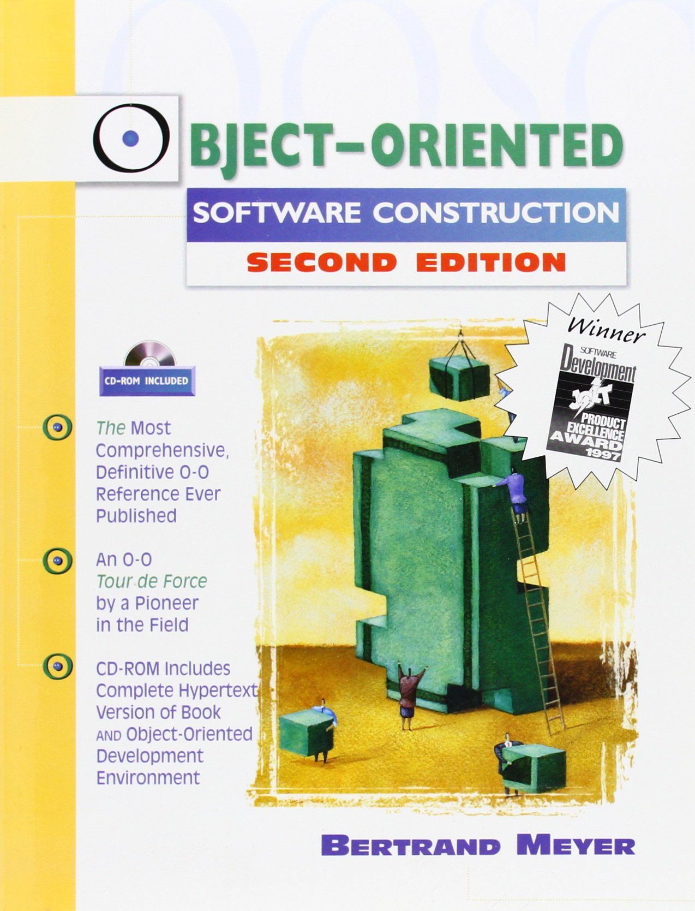
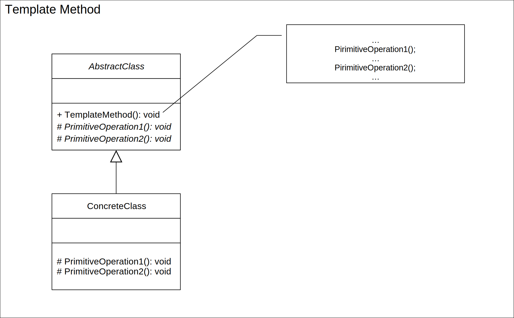
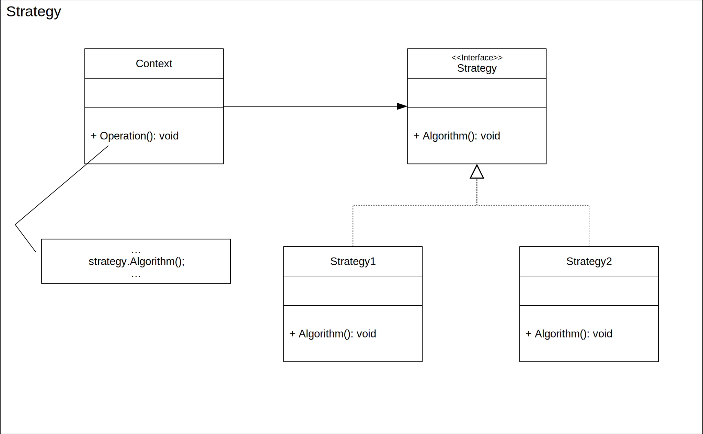
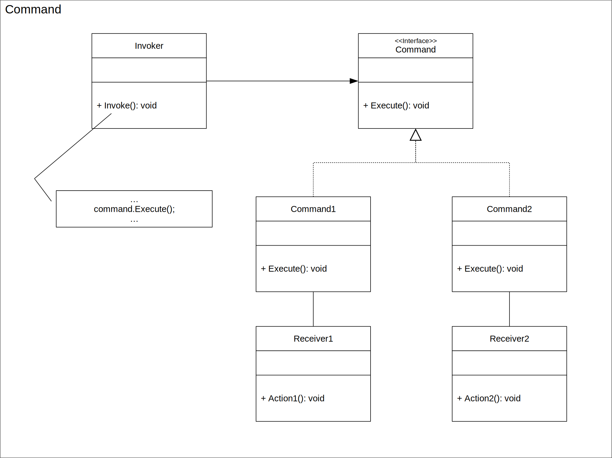
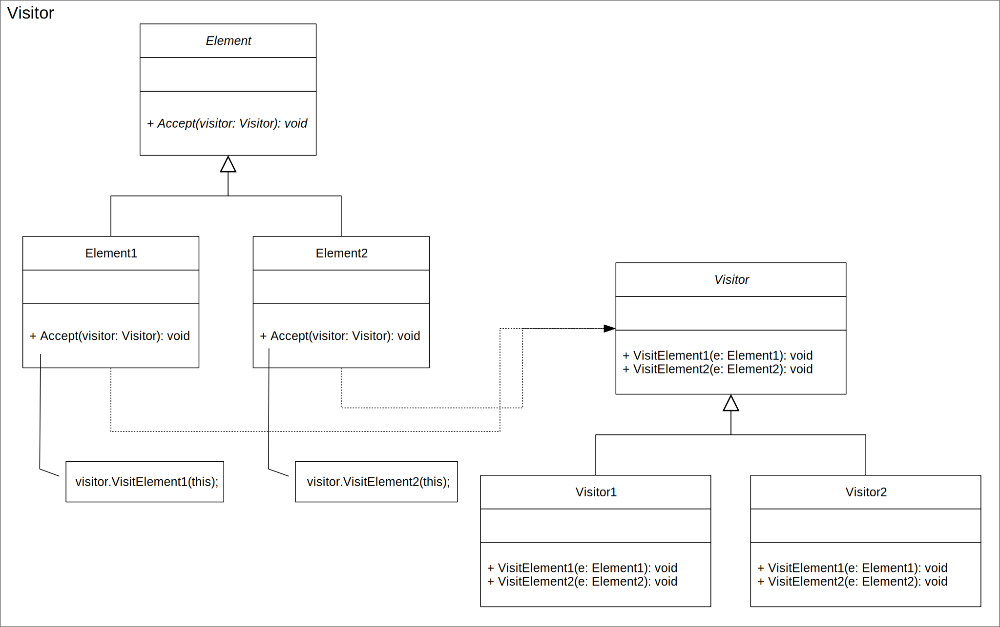

# SOLID
## Open/Closed Principle (OCP)

---

<style scoped>
li { 
  margin: 0px;
}
</style>

### Open/Closed Principle


> **_"You should be able to extend the behavior of a system without having to modify that system."_** [Robert C. Martin]

##### Why?
* Increase of Maintainability
* Increase of Reusability
* Decrease of Rigidity

---

<style scoped>
section {
  font-size: 1.3em
}
blockquote li { 
  margin: 0px;
  font-size: 100%;
}
</style>

### Original Definition



> **_"Software entities (classes, modules, functions, etc.) should be open for extension, but closed for modification._**
> * **_A module will be said to be open if it is still available for extension. For example, it should be possible to add fields to the data structures it contains, or new elements to the set of functions it performs._**
> * **_A module will be said to be closed if [it] is available for use by other modules. This assumes that the module has been given a well-defined, stable description (the interface in the sense of information hiding)"_**
> [Betrand Meyer]

Bertrand Meyer. _Object-Oriented Software Construction, 2nd Edition._ Prentice-Hall 1997, ISBN 0-13-629155-4

Bertrand Meyer. _Object-Oriented Software Construction, 1st edition._ Prentice-Hall 1988, ISBN 0-13-629031-0

---

### Open/Closed Principle

Software entities should be **both** open for extension **and** closed for modification

* **Open for Extension** 
  It is possible to extend behavior
* **Closed for Modification**
  It is not necessary to modify source code

---
### An Academic Example: Higher-Order Functions

Lets say we have a function called $twice$ which applies a given function twice

$$twice : (\mathbb{Z} \rightarrow \mathbb{Z}) \rightarrow \mathbb{Z}$$
$$twice(f,v) := f(f(v))$$

and function called $add3$ which adds 3

$$add3 : \mathbb{Z} \rightarrow \mathbb{Z}$$
$$add3(v) := v + 3$$

Please solve the following equation:

$$ twice(add3,7) = x$$

---
### An Academic Example: Higher-Order Functions
Well, it's 13.

$$ twice(add3,7) = add3(add3(7)) = (7 + 3) + 3 = 13$$

Such systems $S$ can be easily extended to $S'$ without having to modify existing functions.

$$
S =
\{ 
twice : (\mathbb{Z} \rightarrow \mathbb{Z}) \rightarrow \mathbb{Z},
add3 : \mathbb{Z} \rightarrow \mathbb{Z}
\}
$$
$$
S' = S
\cup
\{
sub2 : \mathbb{Z} \rightarrow \mathbb{Z}
\} 
$$

This _"Academic Example"_ illustrates the basic thought behind Open/Closed systems.

$twice$ is both open and closed through its first parameter $f : \mathbb{Z} \rightarrow \mathbb{Z}$.

We can just add new functions of type/signature $\mathbb{Z} \rightarrow \mathbb{Z}$ to $S$ and extend its behavior.

---
### Higher-Order Functions in Code

```c#
// C#
Func<Func<int,int>,Func<ing,int>> twice = f => x => f(f(x));
Func<int,int> add3 = x => x + 2;

Console.WriteLine(twice(add3)(7)) // = 13
```

```javascript
// JavaScript
const twice = (f, v) => f(f(v))
const add3 = v => v + 3

console.log(twice(add3, 7)) // = 13
```

```haskell
-- Haskell
twice f = f . f
main = print $ twice (+3) 7 -- 13
```

---
### "Real World" Open/Closed Systems

* **Plugin Architectures**
  * **Operating Systems**
  Can be extended by programs and apps without having to modify the operating system itself
  * **Integrated Development Environments (IDEs)**
  Visual Studio, VSCode, Rider, IntelliJ, etc. can be extended with a multitude of software languages and tools without having to modify the IDE program itself
  * ...

---

### When to use Open/Closed Design?

Software rarely changes completely.

Some code parts are more volatile than others, i.e. are likely to change more frequently.

#### How to create Open/Closed Design?

1. **Identify** volatile code
2. **Separate** volatile code from non-volatile code
3. **"Open/Close"** non-volatile code

#### Word of Warning

Changes are only changes if they occur, see Single Responsibility Principle.

---
### How To Open/Close
#### _Inheritence_

```c#
public class A 
{
  public int U { get; set; }
  public void F()
  {
    ...
  }
}
public class B : A // other languages literally call this operator "extends" ;-)
{
  public int V { get; set; }
  public void G()
  {
    ...
  }
}
```

Class B extends behavior of class A without modifying it.
We omit discussion on _overwriting_, but imagine the possibilities ;-)

---



### How To Open/Close
#### _Template Method Pattern_

Systems can be extended by inherting the base class and implementing the _Template Methods_.

**Good Choice If** you have a set of computations which _differ only in small details_ but have most of their implementation in common.

**Example** Sorting algorithms where only the order is changed.

---



### How To Open/Close
#### _Strategy Pattern_

Systems can be extended by adding new _Strategies_ encapsulating.

**Good Choice If** you have a set of _completely different_ computations within a common context and you want a result returned to you.

**Example** Sorting algorithms, Encryption algorithms.

---



### How To Open/Close
#### _Command Pattern_


Such a system can be easily extended by adding new _Commands_ and _Receivers_ encapsulating behavior.

**Good Choice If** you have a set of _completely different_ action with possibly different _Receivers_ and you don't want a result returned to you

**Example** Writing to databases.

---
### How To Open/Close
#### _Visitor Patern_



Such a system can be easily extended by adding new _Visitors_ encapsulating behavior.

**Good Choice If** you want to traverse an object graph in different ways for different purposes.

**Example** Evaluation of object graphs.

---
# Thanks!
