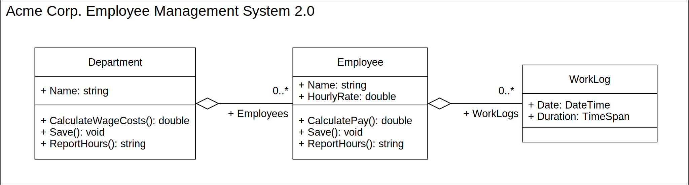
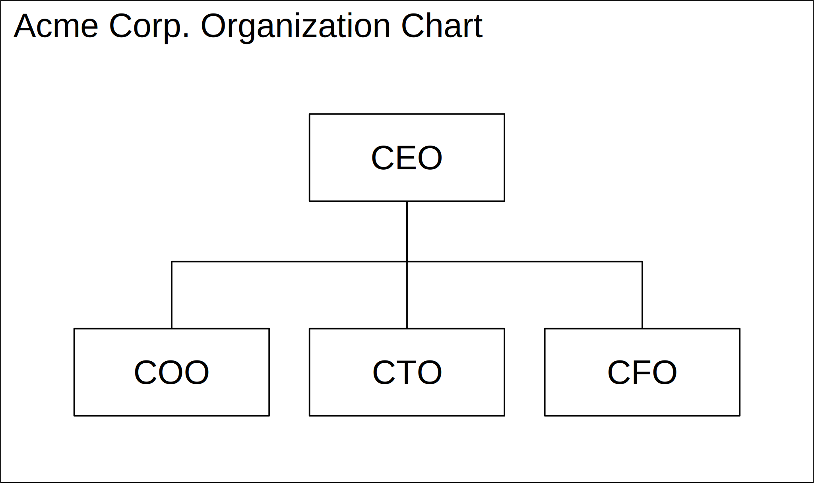
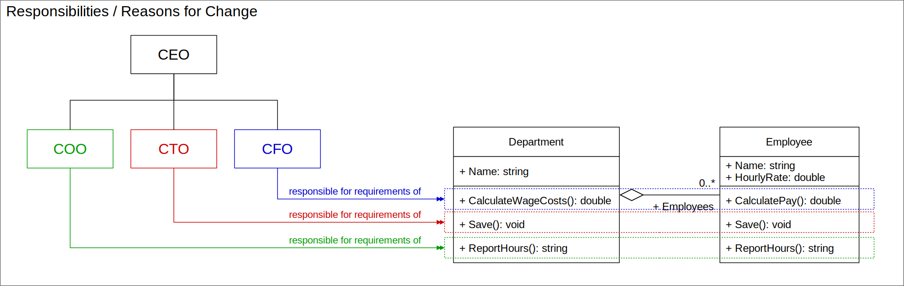
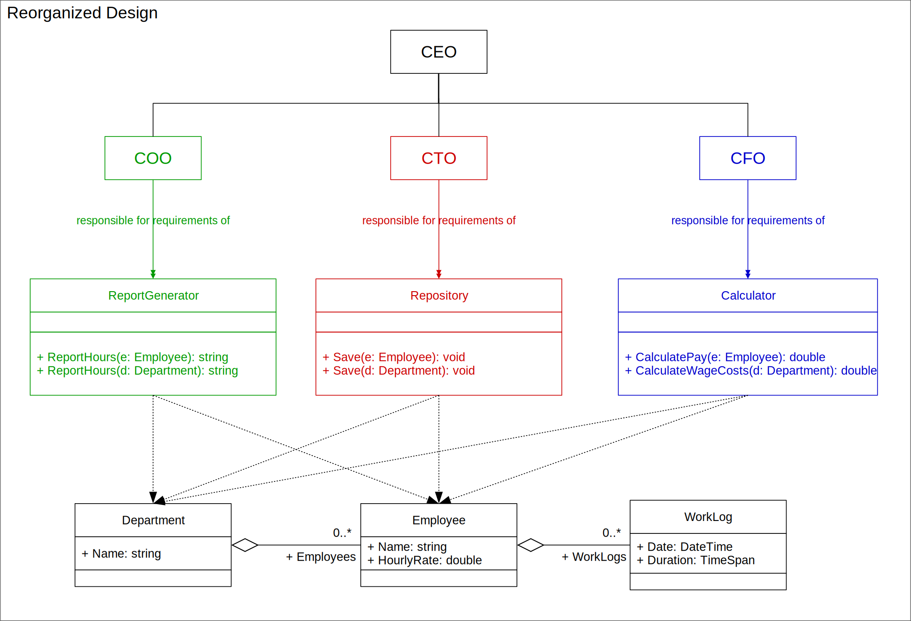

# SOLID
## Single Responsibility Principle (SRP)

---

<style scoped>
li { 
  margin: 0px;
}
</style>

### Single Responsibility Principle


> **_"A class should only have one reason to change."_** [Robert C. Martin]

##### Why?
* Increase of Maintainability
* Decrease of Rigidity

---

### Single Responsibility Principle

Probably first mentioned during the 1970’s in:
David L. Parnas, _On the Criteria To Be Used in Decomposing Systems into Modules._ Commun. ACM 15(12): 1053-1058 (1972)

#### It means 

* **Separate things...** 
...which are likely to change because of _different reasons_.
* **Group things...** 
...which are likely to change because of _the same reason_.

---

### Reasons to change software/code

* **Fixing a bug**
_Old_ requirements have not been met.
* **Adding a feature**
_New_ requirements have not (yet) been met.

There exists only a single reason to change software: **Conformance to requirements**.

#### Where do requirements originate from?

---

### Requirements and Responsibility

The origin of requirements and the meaning of responsibility are related:

##### Definitions of Responsibility:
> _"(1.) The state or fact of having a duty to deal with something or of having control over someone.
**(2.) The state or fact of being accountable or to blame for something.**
(3.) The opportunity or ability to act independently and take decisions without authorization."_
[[https://www.lexico.com/definition/responsibility](https://www.lexico.com/definition/responsibility)]

* Who to respond to?
* Accountable to whom?

---

### Example: Emplyoee Management System



---

### Example: Stakeholders




---

### Example without SRP



Stakeholders may create _axis of change_.

---

### Problem: Coincidental Cohesion

```c#
class Employee 
{
  public double CalculatePay() 
  {
    ...
    HelperMethod();
    ...
  }
  public string ReportHours() 
  {
    ...
    HelperMethod();
    ...
  }
  private void  HelperMethod()
  {
    ... // CHANGES HERE MAY HAVE UNPREDICTABLE EFFECTS OUTSIDE THE AXIS OF CHANGE!
  }
}
```

A change to `HelperMethod` caused by requirements of the COO stakeholders may break requirements of CFO stakeholders.

---

### Example with SRP



---

### Example with SRP


* `ReportGenerator` 
Responds to COO stakeholders.

* `Repository` 
Responds to CTO stakeholders.

* `Calculator` 
Responds to CFO stakeholders.

---

### A Word of Warning


> _"An axis of change is an axis of change only if the changes actually occur."_ [Robert C. Martin]

#### The SRP should not be applied without good cause!

---

# Thanks!