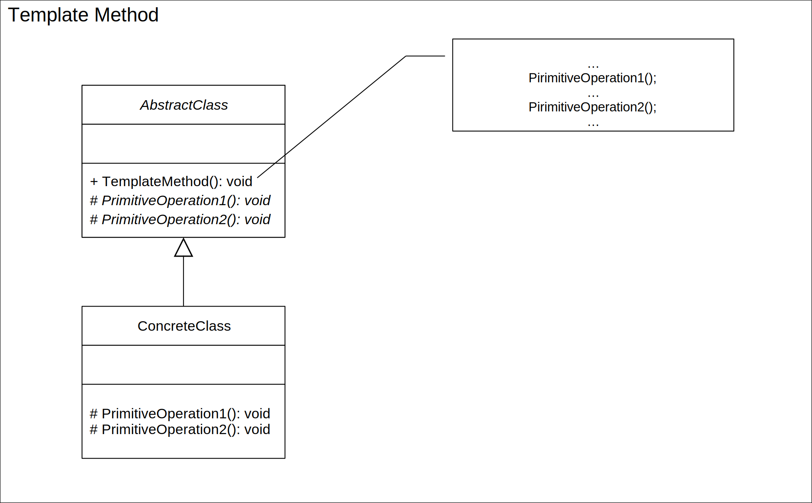
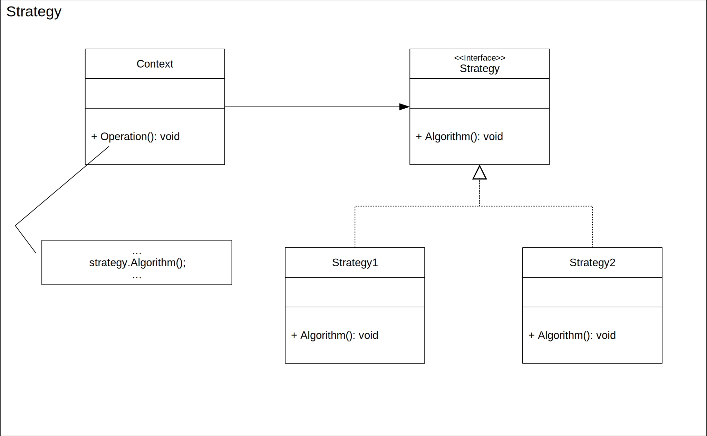
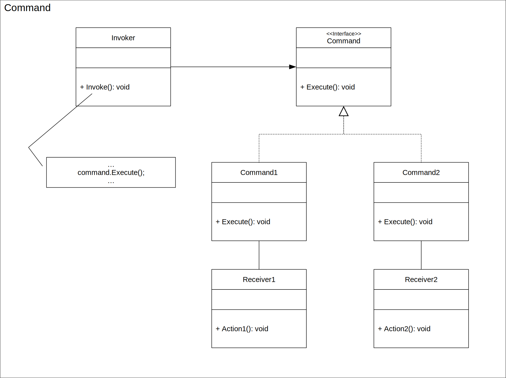
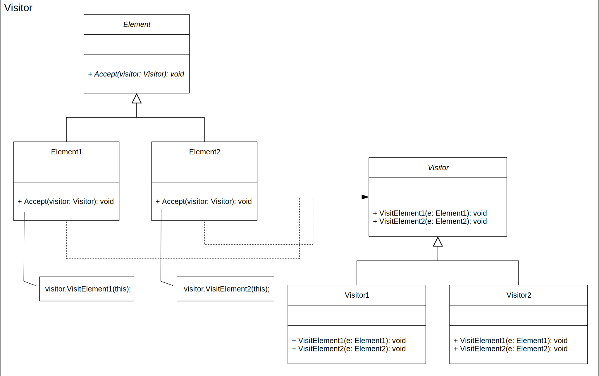

# The Open/Closed Principle
### Principles of Object-Oriented Software Design
##### Maximilian Meffert

---

## The Open/Closed Principle
* Probably around since the late 1980's
  * Betrand Beyer, Object-Oriented Software Construction, 1st edition. Prentice-Hall 1988, ISB 0-13-629031-0

---
## Definition 1 (Bertrand Mayer)
* _"Software entities (classed, modules, functions, etc.) should be open for extension but closed for modifictaion:_
  * _A moudle will be said to be __open__ if it is still available for extension. For example it should be possible to add fields to the data structure it contains, or new elements to the set of functions it performs."_
  * _"A module will be seaid to be __closed__ if [it] is available for use by other modules. This assumes that the module has been given a well-defined, stable description (thi interface int he sense of information hiding)"_

---
## Definition 2 (Robert C. Martin)
_"You should be able to extend the behavior of a system without having to modify that system."_

---
## What does it mean?
* Software entites should be __both__ _Open for Extension_ __and__ _Closed for Modification_ at the same time
* Open for Extensions: It is possible to extend behavior, i.e. adding functionality
* Closed for Modication: It is not necessary to modify (existing) manifestation of the sofware, i.e. source code, compilation, etc.

---
## Why is it a "good" thing?
* Change of requirements is immanent through the life cycle of most software
* The OCP decreases change impact, i.e. the number of moudles to modify
  * This number should tond to 0 since you are just adding or replacing modules
  * Allows new features without the need to re-engineer / re-arange existing ones
* The OCP decreases risk of regression because of human error, i.e. developer faults
  * Because change impact decreases

---
## Example: Higher-Order Functions
```javascript
const twice = (f, v) => f(f(v))
const add3 = v => v + 3

console.log(twice(add3, 7)) // = 13
```

```c#
Func<Func<int,int>,Func<ing,int>> twice = f => x => f(f(x));
Func<int,int> add3 = x => x + 2;

Console.WriteLine(twice(add3)(7)) // = 13
```
---
## Example: Template Method Pattern


---
## Example: Strategy Patern


---
## Example: Command Patern


---
## Example: Visitor Patern



---
# Thanks!

---
## References
* Bertrand Meyer. 1995. Object-oriented software construction, New York: Prentice Hall.
* Robert C. Martin. 2003. Agile Software Development, Principles, Patterns, and Practices, Prentice Hall.
* Robert C. Martin. 2014. The Open Closed Principle. (May 2014). Retrieved April 25, 2019 from http://blog.cleancoder.com/uncle-bob/2014/05/12/TheOpenClosedPrinciple.html